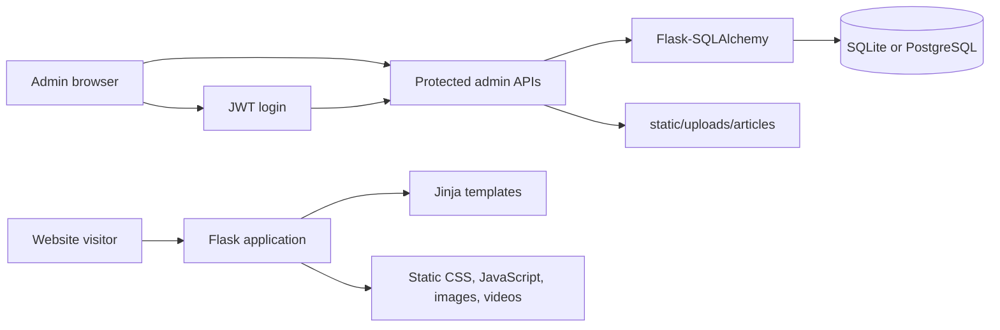

# Patel Engineering Works

Flask-based corporate website and lightweight content-management backend for Patel Engineering Works (Vizag), a marine engineering, shipbuilding, and ship-repair company.

The application combines server-rendered public pages with a database-backed admin area for media articles and job listings. It also includes static assets, responsive navigation, media pages, career pages, and detailed shipbuilding and repair capability pages.

## Key Technical Highlights

- Server-rendered Flask application using Jinja templates.
- SQLAlchemy models with SQLite as the local default and PostgreSQL support through `DATABASE_URL`.
- JWT-based admin authentication with hashed passwords and 24-hour token expiry.
- Protected CRUD APIs for media articles and job listings.
- Article image uploads restricted to PNG, JPG, JPEG, GIF, and WebP files, with up to three images per article request.
- Action history for article create, update, and delete operations.
- Gunicorn and Render Blueprint configuration for deployment.

## Project Overview

The site presents Patel Engineering Works' services, divisions, clients, careers, contact information, media content, and company information. Administrators can authenticate, manage media articles, manage job postings, change the admin password, and review content-management history.

## Architecture



## Features

### Public website

- Company overview, values, leadership, certifications, milestones, clients, careers, contact, privacy, and terms pages.
- Shipbuilding capability pages for hull and superstructure, piping and plumbing, electrical outfitting, machinery and equipment, in-situ machining, and accommodation and habitability.
- Ship repair pages for steel renewal, hydraulics, propulsion, piping, boilers, HVAC, surface preparation, and painting.
- Media gallery, projects, article listing, and article detail pages.
- Responsive navigation with dropdowns, carousels, lightboxes, accordions, filters, hero rotation, scroll effects, and form validation implemented in the frontend JavaScript.

### Admin and content APIs

- JWT login and logout.
- Create, read, update, and delete media articles.
- Upload article images and retain up to three normalized image URLs per article.
- Create, update, toggle, list, and delete job postings.
- View or clear content action history.
- Change the authenticated administrator's password.

## Technology Stack

| Area | Technologies |
| --- | --- |
| Backend | Python, Flask 3.0.3, Jinja templates |
| Database | Flask-SQLAlchemy 3.1.1, SQLite by default, PostgreSQL via `psycopg2-binary` |
| Authentication | PyJWT, Werkzeug password hashing |
| Frontend | HTML, CSS, vanilla JavaScript |
| Production server | Gunicorn |
| Deployment | Render Blueprint (`render.yaml`) |
| Configuration | `python-dotenv` |

There is no machine-learning or AI component in the current implementation.

## Request Workflow

1. A visitor requests a public route such as `/`, `/divisions`, or `/media`.
2. Flask selects the corresponding Jinja template and serves static assets from `static/`.
3. The browser runs the shared JavaScript components for navigation, media interactions, filtering, validation, and page motion.
4. An administrator submits credentials to `/api/auth/login` and receives a signed JWT.
5. The admin client sends the token as `Authorization: Bearer <token>` to protected content APIs.
6. Flask validates the token, validates request data, updates SQLAlchemy models, stores permitted uploads, and returns JSON.

## Project Structure

```text
Patel-Engineering-Works/
├── app.py                  # Flask application factory, routes, auth, and APIs
├── models.py               # SQLAlchemy models and serialization helpers
├── requirements.txt        # Python dependencies
├── render.yaml             # Render web service and PostgreSQL blueprint
├── schema.sql              # Database schema reference
├── templates/              # Public, admin, and shared Jinja templates
├── static/                 # CSS, JavaScript, images, videos, and uploads
├── public/                 # Static site copy and assets used by the static deployment notes
├── docs/                   # Admin, deployment, and email setup notes
├── scripts/                # Maintenance scripts for templates and site content
├── scratch/                # One-off content and asset migration scripts
└── structure.md            # Additional architecture and folder notes
```

## Installation

### Prerequisites

- Python 3.11 or newer.
- Git.
- PostgreSQL only if you want to use PostgreSQL locally; SQLite is the default.

### Local setup

From the repository root:

```bash
python -m venv .venv
```

Activate the environment:

```bash
# Windows PowerShell
.venv\Scripts\Activate.ps1

# macOS/Linux
source .venv/bin/activate
```

Install dependencies:

```bash
python -m pip install --upgrade pip
python -m pip install -r requirements.txt
```

On first startup, the application creates database tables and the configured upload directory automatically.

## Environment Variables

Create a local `.env` file when you need values different from the defaults. Never commit real secrets.

```dotenv
DATABASE_URL=sqlite:///pew_vizag.db
JWT_SECRET_KEY=replace-with-a-long-random-secret
FLASK_DEBUG=false
PORT=5000
```

| Variable | Purpose | Default |
| --- | --- | --- |
| `DATABASE_URL` | SQLAlchemy database connection string. `postgres://` is normalized to `postgresql://`. | `sqlite:///pew_vizag.db` |
| `JWT_SECRET_KEY` | Secret used to sign administrator JWTs. | Development fallback in `app.py`; replace in production |
| `FLASK_DEBUG` | Enables Flask debug mode when set to `true`. | `false` |
| `PORT` | Port used by the application process. | `5000` |

Render supplies `DATABASE_URL`, generates `JWT_SECRET_KEY`, and sets Python 3.11.11 through `render.yaml`.

## Running the Application

```bash
python app.py
```

The development server listens on `http://127.0.0.1:5000` (and binds to `0.0.0.0` for container or platform use). Useful pages include:

- `http://127.0.0.1:5000/`
- `http://127.0.0.1:5000/media`
- `http://127.0.0.1:5000/careers`
- `http://127.0.0.1:5000/admin`

For a production-style local process:

```bash
gunicorn app:app --bind 0.0.0.0:5000 --workers 2 --threads 4 --timeout 120
```

## API Documentation

All JSON endpoints are served by the Flask application. Protected endpoints require `Authorization: Bearer <jwt>`.

### Authentication

| Method | Endpoint | Auth | Description |
| --- | --- | --- | --- |
| POST | `/api/auth/login` | No | Validate username and password; return a JWT. |
| POST | `/api/auth/logout` | JWT | Return a logout response; the client removes the token. |
| PUT | `/api/admin/password` | JWT | Change the authenticated administrator password. |

Login body:

```json
{
	"username": "your-admin-username",
	"password": "your-admin-password"
}
```

### Articles

| Method | Endpoint | Auth | Description |
| --- | --- | --- | --- |
| GET | `/api/articles` | No | List articles, newest first. |
| GET | `/api/articles/<id>` | No | Return one article. |
| POST | `/api/articles` | JWT | Create an article. Requires `title`, `content`, and `category`. |
| PUT | `/api/articles/<id>` | JWT | Update article fields and optional images. |
| DELETE | `/api/articles/<id>` | JWT | Delete an article and record the action. |

Article create and update requests accept JSON or `multipart/form-data`. Uploaded fields are `image_file` or `image_files`; accepted extensions are PNG, JPG, JPEG, GIF, and WebP.

### Jobs and history

| Method | Endpoint | Auth | Description |
| --- | --- | --- | --- |
| GET | `/api/jobs` | No | List open jobs. |
| GET | `/api/admin/jobs` | No | List all jobs. |
| POST | `/api/admin/jobs` | JWT | Create a job; `title`, `department`, and `description` are required. |
| PUT | `/api/admin/jobs/<id>` | JWT | Update a job. |
| POST | `/api/admin/jobs/<id>/toggle` | JWT | Toggle a job between open and closed. |
| DELETE | `/api/admin/jobs/<id>` | JWT | Delete a job. |
| GET | `/api/admin/history` | JWT | Return recent content actions; supports `limit`. |
| DELETE | `/api/admin/history` | JWT | Clear content action history. |

## Database

The application calls `db.create_all()` during startup. The models in `models.py` define:

- `AdminUser`: unique username and hashed password.
- `Article`: title, content, category, primary image, optional JSON image list, and creation time.
- `Job`: title, department, location, employment type, experience, salary, description, requirements, status, and creation time.
- `ContentHistory`: action, entity, entity ID, category, details, administrator, and timestamp.
- `GalleryImage` and `Video`: model definitions for gallery and video content.

The default local database is `pew_vizag.db`. Render provisions PostgreSQL through the Blueprint. Uploaded article images are stored below `static/uploads/articles`.

## Security and Error Handling

- Passwords are stored using Werkzeug password hashing rather than plaintext storage.
- Protected API routes validate JWT signatures and expiration before accessing admin operations.
- Uploaded filenames are sanitized with `secure_filename`, extensions are allowlisted, and generated UUID names prevent filename collisions.
- Required request fields and invalid credentials produce JSON error responses with appropriate 4xx status codes.
- Missing records use Flask's `404` handling through `get_or_404`.

The application currently includes permissive CORS response headers. Review and restrict the allowed origin, headers, and methods before exposing the API publicly. The development fallback JWT secret and the initial admin password configured in `app.py` must also be replaced or changed for production use.

## Deployment

`render.yaml` defines a Python web service using:

```text
Build: pip install -r requirements.txt
Start: gunicorn app:app --bind 0.0.0.0:$PORT --workers 2 --threads 4 --timeout 120
```

The Blueprint also defines a managed PostgreSQL database and a 5 GB persistent disk mounted at `/opt/render/project/src/static/uploads`. See [docs/RENDER_DEPLOYMENT.md](docs/RENDER_DEPLOYMENT.md) for the deployment notes.

## Testing and Verification

No automated test suite is currently included in the repository. A basic manual smoke check after startup is:

```bash
curl -I http://127.0.0.1:5000/
curl -I http://127.0.0.1:5000/media
```

Performance metrics and benchmark results are not currently documented.

## Current Limitations and Future Improvements

- Public and administrative functionality share the same Flask application; a more granular production deployment boundary may be useful as the project grows.
- CORS is currently wildcarded and should be restricted to trusted origins.
- The repository contains both Flask templates and a `public/` static-site copy; consolidating the source of truth would reduce maintenance ambiguity.
- No automated tests, migrations, or formal API schema are currently provided.
- Contact email integration is documented in [docs/SMTP_SETUP.md](docs/SMTP_SETUP.md), but an external EmailJS or Formspree service must be configured before it can send messages.
- Object storage, a formal migration tool, and automated CI checks would improve operational readiness.

## License

No license file or verified open-source license is included in the repository.
